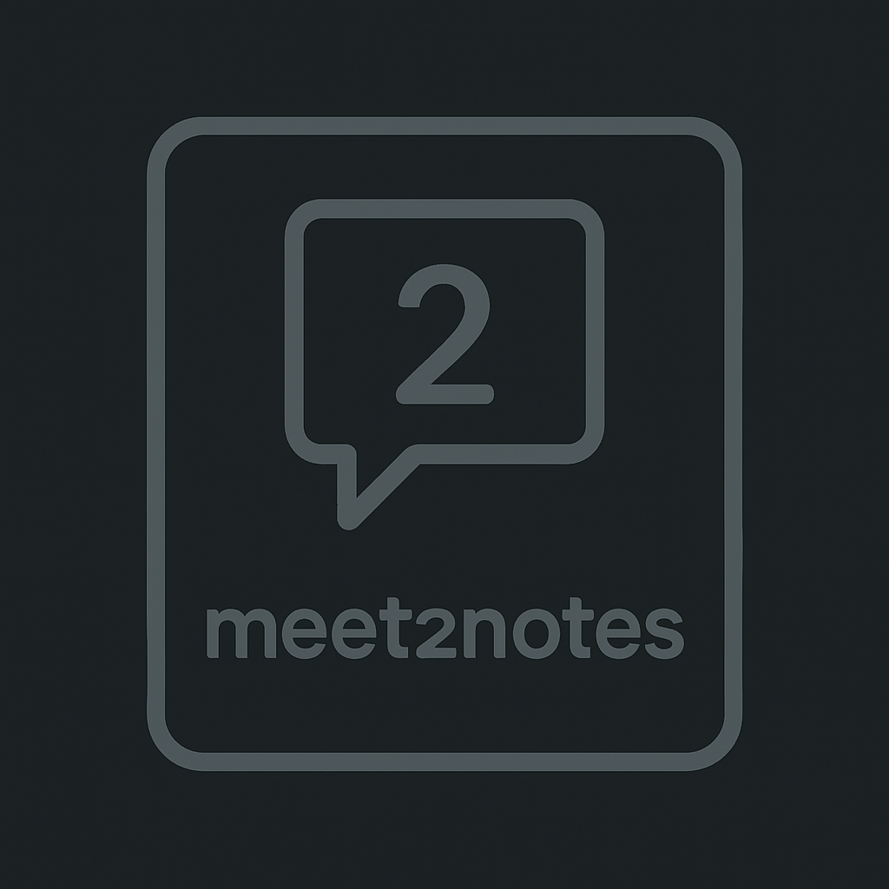

# Meet2Notes

<p align="center">
  
</p>

## 🚀 Your Meeting Recordings → Text + Summary in Minutes

Meet2Notes is a single-command solution that converts meeting recordings into searchable transcripts and actionable summaries.

[](LICENSE)
[](https://www.python.org/downloads/)

## ✨ Features

- **Audio Extraction**: Extract high-quality audio from any video format
- **Local Transcription**: Convert speech to text offline using OpenAI Whisper
- **Smart Summaries**: Generate concise meeting notes with key points
- **Action Item Extraction**: Automatically identify tasks and assignments
- **Markdown Output**: Get beautifully formatted, shareable documents

## 🛠️ Quick Start

### Prerequisites

- Python 3.8 or higher
- FFmpeg (included in repository)
- OpenAI API key (for summary generation)

### Installation

1. Clone the repository:
```bash
git clone https://github.com/MartinMcCurley/meet2notes.git
cd meet2notes
```

2. Install required packages:
```bash
pip install -r requirements.txt
```

3. (Optional) Install as a package:
```bash
pip install -e .
```

4. Copy `.env.example` to `.env` and set your OpenAI API key:
```bash
cp .env.example .env
# Edit .env with your API key
```

### Usage

#### One-Command Workflow

The simplest way to use Meet2Notes is with the all-in-one runner script:

```bash
# If installed as a package:
meet2notes your_meeting.mkv --model base --api-key YOUR_API_KEY

# Or using the module directly:
python -m src.run your_meeting.mkv --model base --api-key YOUR_API_KEY

# Skip summary generation (transcription only)
meet2notes your_meeting.mkv --model base --no-summary
```

#### Step-by-Step Workflow

If you prefer more control, you can run each component separately:

```bash
# 1. Extract audio from video
python -m src.meeting2notes your_meeting.mkv

# 2. Transcribe audio to text (with timestamps)
python -m src.quick_transcribe --model base

# 3. Generate meeting notes with summary and action items
python -m src.notes_generator --api-key YOUR_API_KEY
```

#### Advanced Options

```bash
# Use a higher quality transcription model
python -m src.quick_transcribe --model small

# Customize output file names
python -m src.notes_generator --transcript my_transcript.txt --output custom_notes.md
```

## 🧩 Components

Meet2Notes consists of three main components:

1. **meeting2notes.py**: Extracts audio from video files using FFmpeg
2. **quick_transcribe.py**: Transcribes audio to text using Whisper
3. **notes_generator.py**: Creates formatted meeting notes with OpenAI

## 📁 Project Structure

```
meet2notes/
├── docs/                     # Documentation
│   └── images/               # Images for documentation
├── examples/                 # Example files and demos
├── ffmpeg-7.1.1-essentials_build/  # FFmpeg binaries
│   ├── bin/                  # Executable files
│   └── ...
├── media/                    # Local meeting files (not tracked by git)
├── src/                      # Source code
│   ├── __init__.py           # Package initialization
│   ├── meeting2notes.py      # Audio extraction script
│   ├── notes_generator.py    # Meeting notes generation script
│   ├── quick_transcribe.py   # Audio transcription script
│   └── run.py                # All-in-one workflow script
├── tests/                    # Test files
│   └── __init__.py           # Test initialization
├── .env                      # Environment variables (not tracked by git)
├── .env.example              # Example environment file
├── .gitignore                # Git ignore patterns
├── LICENSE                   # MIT License
├── README.md                 # This file
└── requirements.txt          # Python dependencies
```

## 📊 Example Output

```markdown
# Meeting Notes - 2025-05-20

## Summary
Meeting discussion focused on product roadmap, feature priorities, and team assignments...

## Key Points
- **Product Roadmap**: Q3 goals include...
- **Feature Priorities**: User authentication will be implemented first...

## Action Items
- **Alex**: Create wire frames by Friday
- **Sarah**: Review user feedback and prioritize bug fixes
- **Team**: Schedule user testing sessions for next week
```

## 📝 License

This project is licensed under the MIT License - see the [LICENSE](LICENSE) file for details.

## 🤝 Contributions

Contributions are welcome! Please feel free to submit a Pull Request. 